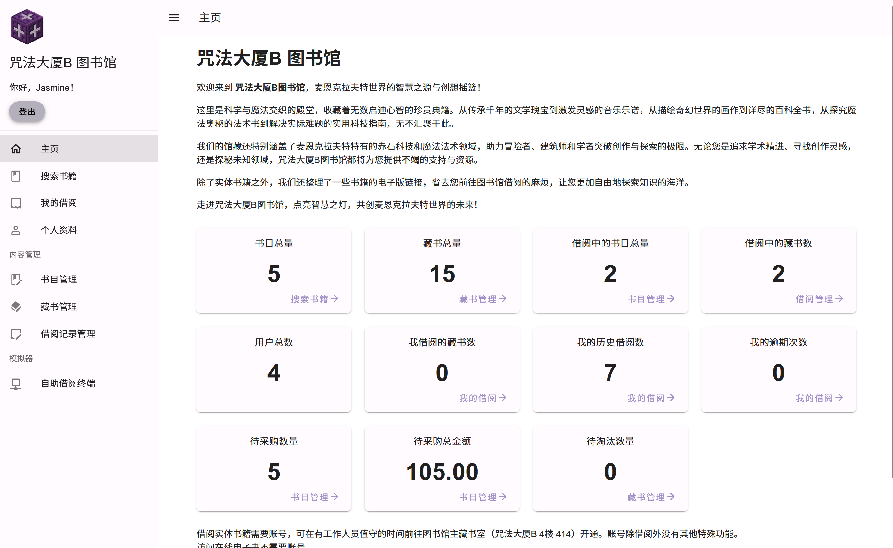

# 咒法大厦B 图书馆管理系统

这是一个用作数据库基础课程大作业的图书馆管理系统。

注意：由于连夜赶工，代码质量并不好，许多用户体验以及安全性细节也没有太多优化。此系统不建议用于生产环境，使用导致任何问题后果自负。



## 功能

- 用户系统，分为 Root、Admin、Librarian 和 Reader 四级权限。暂不支持免密登录和找回密码。
- 书目管理、藏书管理、书目查询、借阅记录查询。
- 书籍待采购与待淘汰状态。
- 模拟图书馆自助借阅终端功能。
- 借阅情况与逾期情况统计。

## 配置说明

此仓库是包含后端 `backend/`、前端 `frontend/` 以及两者共享代码 `common/` 的 yarn workspace。在开始前，需要先安装合适的 NodeJS 和 Yarn。

参考版本：NodeJS v23.2.0、Yarn 1.22.22

### 初始化

在仓库根目录下执行命令：

```
yarn
```

### 后端

后端部分使用 TypeScript 编写，并利用 `tsx` 直接进行无转译的运行。

#### 配置文件

首先将配置文件 `env.example` **重命名**为 `.env`，然后按照其中的说明配置应用功能以及数据库连接。请务必在数据库中提前设置合适的字符集。不建议使用不区分大小写的字符集（尽管并不会出现严重问题）。

`SECRET` 区域中的选项除了数据库密码外，其他保持默认设置就可以运行，但在生产环境下，为了安全，请勿使用默认值。默认配置文件中 `LIBRARY_TERMINAL_SECRET_HASH` 对应的 secret 是 `abc123`。

#### 运行

以调试模式运行：

```
cd backend
yarn dev
```

运行单元测试：

```
cd backend
yarn test
```

以生产环境模式运行：

```
cd backend
yarn start
```

除 API 外，服务端还会向客户端提供 `public` 文件夹内的静态文件。

⚠ 默认配置下，生产环境运行会使端口开放至局域网。

#### 修改 Root 账户密码

初次运行后端时会在图书管理系统中自动创建一个用户名为 `root` 的超级管理员用户，并随机生成其密码。密码会在终端中打印，此时请记下密码，并尽快登录 `root` 用户修改密码。初次生成的 `root` 密码只会打印这一次，若丢失则无法再获取。

非特殊情况请勿从数据表中删除 `root` 账户。若后端启动时检测到没有超级管理员，会重新创建一个。

### 前端

前端使用 TypeScript + Vue + Vite 运行。

#### 配置

若你修改了后端的端口号，请在 `vite.config.ts` 中的代理设置处更新后端的端口号。

接下来，为了使图书馆自助借阅终端界面能够工作，你需要在每次打开页面后将浏览器窗口的 `window.__library_terminal_secret` 属性设置为正确的 Library Terminal Secret（见后端配置文件）。使用下面的 UserScript 可以自动在浏览器中设置：

```js
// ==UserScript==
// @name        Library Management Terminal Secret
// @namespace   Library Management
// @match       http://localhost:4325/
// @grant       none
// @version     1.0
// @author      -
// @description 2024/11/22 09:25:19
// ==/UserScript==

window.__library_terminal_secret = 'abc123'
```

#### 运行

以调试模式直接运行，有热加载支持：

```
cd frontend
yarn dev
```

将前端构建为静态页面：

```
cd frontend
yarn build
```

预览构建后的页面：

```
cd frontend
yarn preview
```
